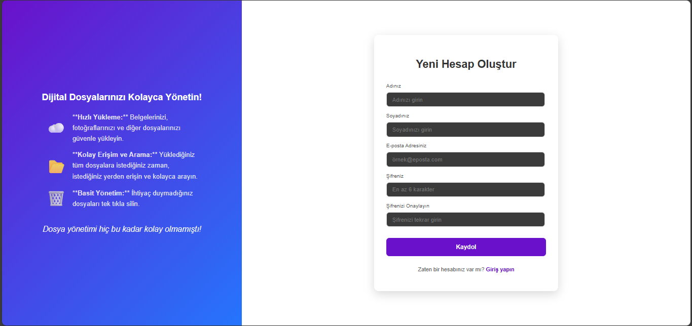
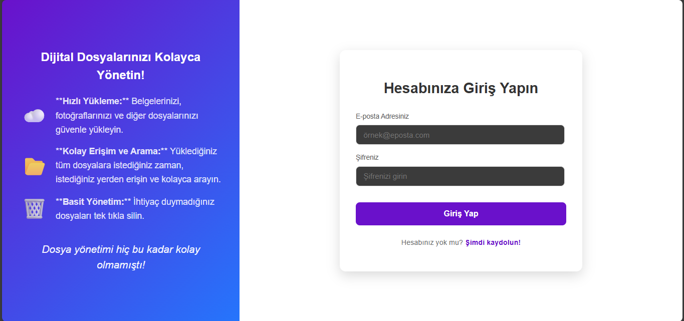
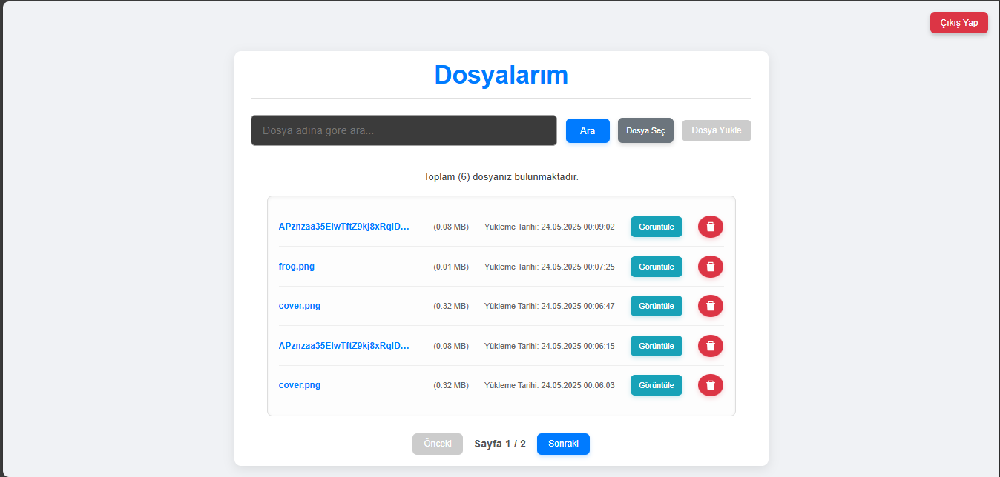
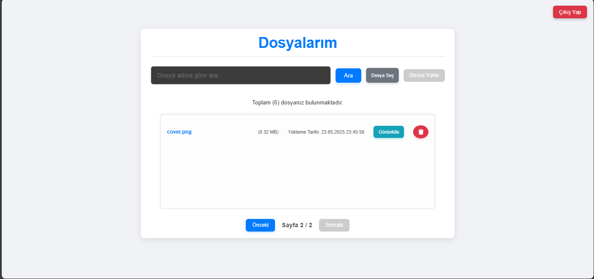
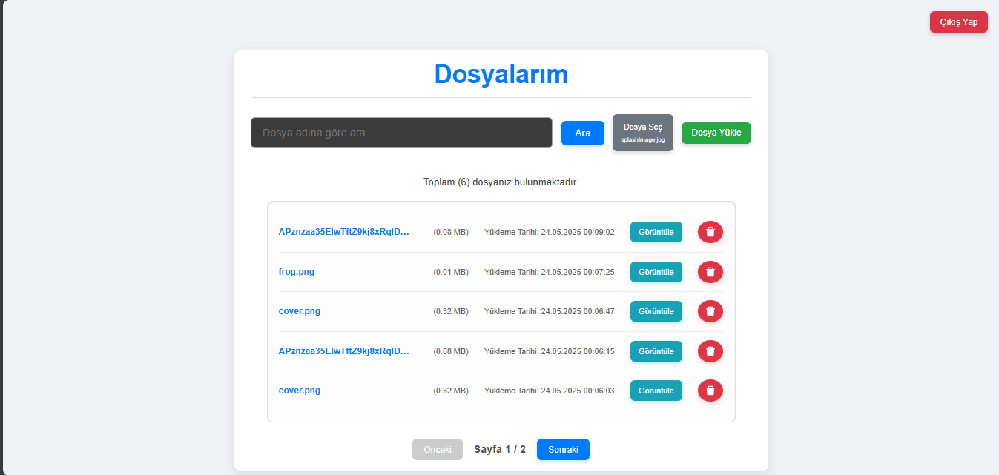
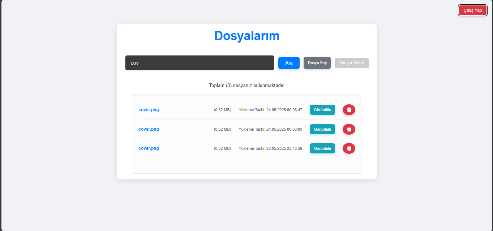
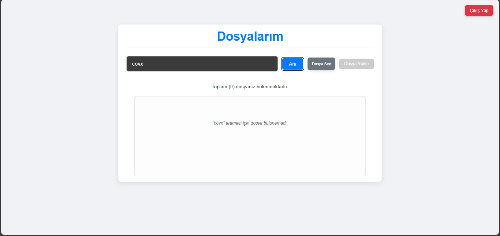

# Dosya Yükleme ve Yönetimi Uygulaması (Full Stack)

Bu proje, kullanıcıların dosyalarını güvenli bir şekilde yükleyebileceği, listeleyebileceği, arayabileceği, görüntüleyebileceği ve silebileceği basit bir bulut tabanlı dosya depolama uygulamasıdır. Kullanıcı yönetimi (kayıt/giriş) ve dosya işlemleri için Flask (Backend) ve React (Frontend) kullanılmıştır. Dosyalar Supabase Storage'da, meta verileri PostgreSQL veritabanında saklanır.

## 🚀 Özellikler

### Kullanıcı Kaydı ve Girişi (Authentication)
Kullanıcılar, basit ve güvenli bir arayüz aracılığıyla adları, soyadları, e-posta adresleri ve belirledikleri şifrelerle sisteme yeni bir hesap oluşturabilirler.


Mevcut kullanıcılar ise e-posta ve şifre bilgilerini kullanarak güvenli bir şekilde hesaplarına erişim sağlayabilirler.


### Dashboard Ekranı
Kullanıcılar giriş yaptıktan sonra, yükledikleri tüm dosyalara kolayca erişebilecekleri ve yönetebilecekleri kişisel bir dashboard ekranına yönlendirilirler. Bu ekranda dosyalarınızı listeleyebilir ve sayfalama özelliklerini kullanarak tüm dosyalarınız arasında gezinebilirsiniz.




### Dosya Yükleme
Kullanıcılar, sezgisel bir arayüz sayesinde yerel cihazlarından diledikleri dosyaları sisteme hızlı ve güvenli bir şekilde yükleyebilirler. Yüklenen dosyalar Supabase bulut depolama alanına kaydedilir.


### Dosya Adına Göre Arama
Dashboard'daki arama çubuğunu kullanarak, yüklediğiniz dosyalar arasında dosya adına göre hızlı ve etkili bir şekilde arama yapabilirsiniz. Arama sonuçları anında güncellenerek ilgili dosyaların listelenmesini sağlar.


Aranan dosyanın bulunamadığı durumlarda ise kullanıcıya dostça bir mesaj gösterilerek arama sonucunun başarısız olduğu bilgisi verilir.


### Dosya Görüntüleme
Her dosya için, dosya tipine göre doğrudan tarayıcıda görüntülenebilen veya indirilmesi tetiklenen bir bağlantı bulunur. Bu özellik, dosyalarınıza hızlı ve pratik erişim sağlar.

### Dosya Silme
Kullanıcılar, ihtiyaç duymadıkları dosyaları dashboard üzerinden kolayca silebilirler. Silme işlemi, yanlışlıkla veri kaybını önlemek amacıyla ek bir onay adımı içerir ve dosya hem bulut depolamadan hem de veritabanından tamamen kaldırılır.

---

## 🛠️ Teknolojiler

**Backend:**
* **Python:** Flask (Web Framework)
* **Veritabanı:** PostgreSQL (Supabase'in sunduğu)
* **Bulut Depolama:** Supabase Storage
* **Bağımlılıklar:** `psycopg2`, `python-dotenv`, `supabase-py`, `Flask`, `Flask-CORS`, `psycopg2-binary`, `Werkzeug` .

**Frontend:**
* **JavaScript:** React.js (UI Kütüphanesi)
* **HTTP İstemcisi:** Axios
* **Yönlendirme:** React Router DOM
* **Bağımlılıklar:** `@ant-design/icons` (ikonlar)

---
## ⚙️ Kurulum ve Çalıştırma

Bu proje, hem Frontend hem de Backend bileşenlerine sahiptir. Aşağıdaki adımları takip ederek projenizi yerel ortamınızda çalıştırabilirsiniz.

### Önkoşullar

Bu projeyi çalıştırmak için aşağıdaki yazılımların sisteminizde yüklü olması gerekmektedir:

* **Python 3.x**
* **Node.js & npm (veya Yarn)**
* **PostgreSQL veritabanı (yerel veya bulut)** - *Bu projede Supabase kullanıldığından, bir Supabase projesi oluşturmanız gerekecektir.*

### Supabase Kurulumu (Çok Önemli!)

1.  **Supabase Hesabı Oluşturma:** [Supabase web sitesi](https://supabase.com/) üzerinden ücretsiz bir hesap oluşturun.
2.  **Yeni Proje Oluşturma:** Supabase paneline giriş yapın ve yeni bir proje oluşturun.
3.  **API Anahtarları:** Projenizin "Settings" -> "API" bölümünden **`anon (public)` key** ve **`service_role (secret)` key**'i not alın. Ayrıca "Project URL" bilgisini de kaydedin.
4.  **Depolama (Storage) Ayarları:** "Storage" bölümüne gidin ve uygulamanızın kullanacağı bir bucket (örneğin `files-bucket`) oluşturun. Varsayılan izinleri (`public` veya `authenticated`) uygulamanızın gereksinimlerine göre ayarlayın. Genellikle dosyaların herkes tarafından görüntülenebilmesi için `public` ayarı kullanılır, ancak yükleme ve silme işlemleri için yetkilendirme Backend tarafından sağlanır.
5.  **Veritabanı Tablosu:** Aşağıdaki SQL şemasını kullanarak `public` şemasında `files` tablosunu oluşturun:

    ```sql
    CREATE TABLE files (
        id UUID PRIMARY KEY DEFAULT gen_random_uuid(),
        user_id UUID NOT NULL,
        original_name TEXT NOT NULL,
        stored_name TEXT NOT NULL,
        size_bytes BIGINT NOT NULL,
        mime_type TEXT NOT NULL,
        uploaded_at TIMESTAMP WITH TIME ZONE DEFAULT CURRENT_TIMESTAMP,
        public_url TEXT -- Dosyanın doğrudan erişilebilir URL'si
    );
    -- Kullanıcı ID'si için bir index eklemek, sorgu performansını artırabilir
    CREATE INDEX idx_files_user_id ON files (user_id);
    ```

### Backend Kurulumu (Flask)

1.  Proje klasörüne gidin ve Backend dizinine geçin:
    ```bash
    cd your-project-name/backend
    ```

2.  Bir Python sanal ortamı oluşturun ve etkinleştirin:
    ```bash
    python -m venv venv
    # Windows
    .\venv\Scripts\activate
    # macOS/Linux
    source venv/bin/activate
    ```

3.  Gerekli Python bağımlılıklarını yükleyin:
    ```bash
    pip install -r requirements.txt
    ```

4.  **`.env` dosyası oluşturma:** Backend dizininin kökünde `.env` adında bir dosya oluşturun ve Supabase bilgilerinizle doldurun:
    ```dotenv
    SUPABASE_URL=YOUR_SUPABASE_PROJECT_URL
    SUPABASE_KEY=YOUR_SUPABASE_SERVICE_ROLE_KEY
    SUPABASE_BUCKET_NAME=your-bucket-name # Örn: files-bucket
    SUPABASE_DB_HOST=YOUR_SUPABASE_HOST
    SUPABASE_DB_NAME=YOUR_SUPABASE_NAME
    SUPABASE_DB_USER=YOUR_SUPABASE_USER
    SUPABASE_DB_PASSWORD=YOUR_SUPABASE_PASSWORD
    SUPABASE_DB_PORT=YOUR_SUPABASE_PORT
    ```
    * `YOUR_SUPABASE_PROJECT_URL`: Supabase projenizin API ayarlarından `Project URL`.
    * `YOUR_SUPABASE_SERVICE_ROLE_KEY`: Supabase projenizin API ayarlarından `service_role (secret)` key.
    * `your-bucket-name`: Supabase Storage'da oluşturduğunuz bucket adı (örneğin `files-bucket`).
    * `YOUR_SUPABASE_HOST`, `YOUR_SUPABASE_NAME`, `YOUR_SUPABASE_USER`, `YOUR_SUPABASE_PASSWORD`, `YOUR_SUPABASE_PORT`: Supabase projenizin "Database" -> "Connection String" kısmından öğrenebilirsiniz.
    
5.  Flask uygulamasını başlatın:
    ```bash
    python app.py
    ```
    Varsayılan olarak `http://127.0.0.1:5000` adresinde çalışacaktır.

### Frontend Kurulumu (React)

1.  Proje klasörüne gidin ve Frontend dizinine geçin:
    ```bash
    cd your-project-name/frontend
    ```
2.  Gerekli JavaScript bağımlılıklarını yükleyin:
    ```bash
    npm install # veya yarn install
    ```
3.  **API Endpoint'lerini Yapılandırma:** `frontend/src/config.js` (veya benzeri bir dosya) içinde API endpoint'lerini Backend'inizin çalıştığı adrese göre güncelleyin:
    ```javascript
    export const BACKEND_BASE_URL = 'http://127.0.0.1:5000'; // Backend adresiniz buraya gelecek

    export const API_ENDPOINTS = {
        signIn: `${BACKEND_BASE_URL}/signin`,
        signUp: `${BACKEND_BASE_URL}/signup`,
        uploadFile: `${BACKEND_BASE_URL}/upload-file`,
        listFiles: `${BACKEND_BASE_URL}/list-files`,
        deleteFile: `${BACKEND_BASE_URL}/delete-file`,
        searchFiles: `${BACKEND_BASE_URL}/files/search`,
    };
    ```
4.  React uygulamasını başlatın:
    ```bash
    npm run dev # veya yarn start
    ```
    Varsayılan olarak `http://localhost:3000` adresinde çalışacaktır.

---

## 🤝 Katkıda Bulunma

Bu projeye katkıda bulunmak isterseniz, lütfen bir Pull Request (PR) göndermekten çekinmeyin. Her türlü katkı takdirle karşılanır.

---
